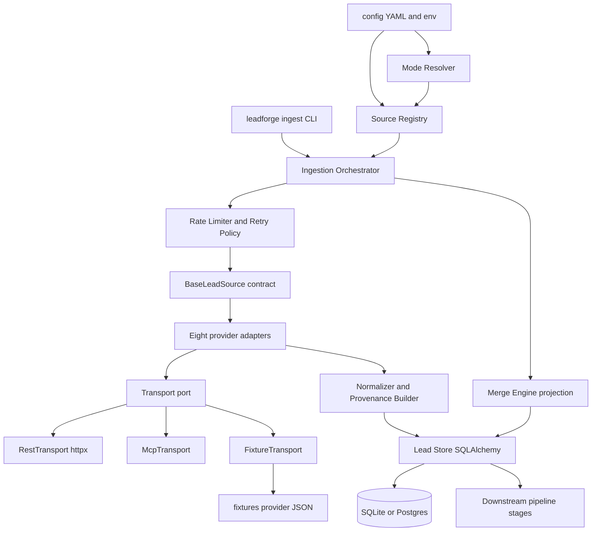
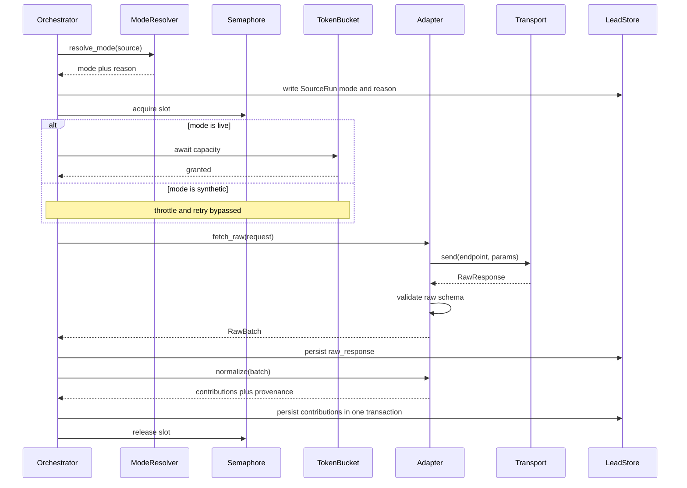
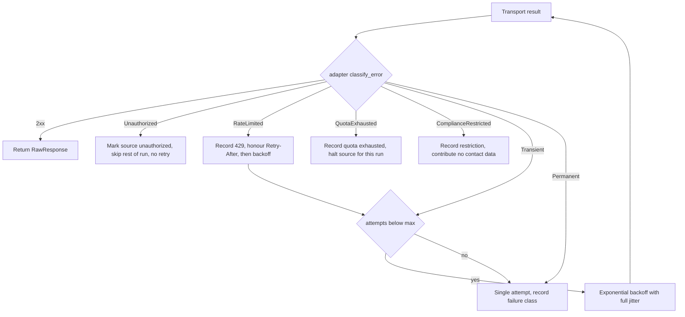
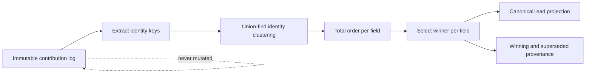
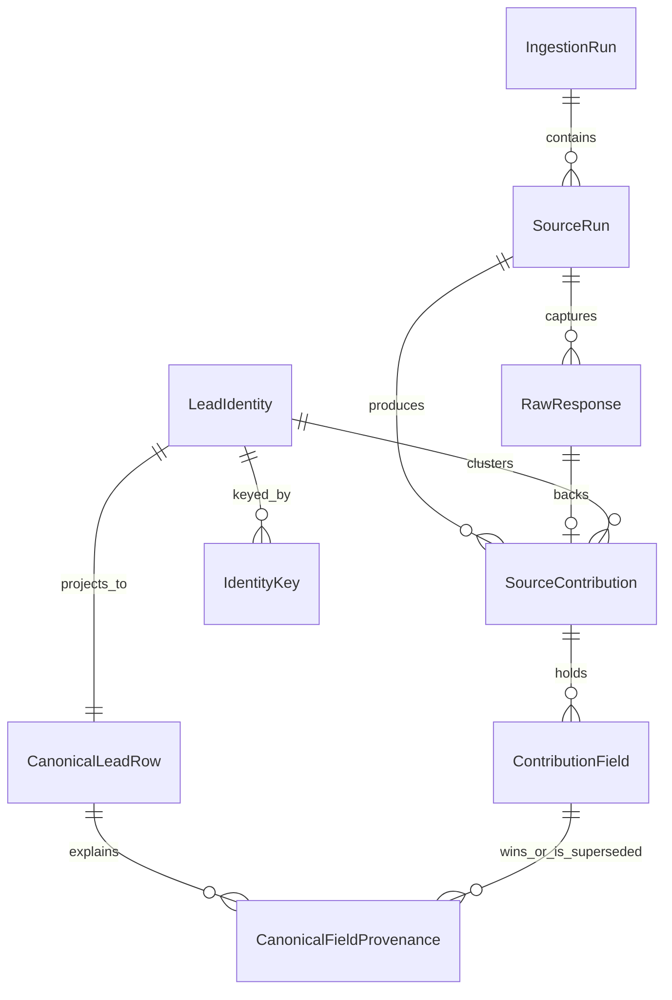

# Technical Design: lead-source-adapters

## Overview

**Purpose**: This feature delivers the **Lead Ingestion Layer** — the first stage of the LeadForge pipeline — to downstream pipeline stages (qualification, personalization, guardrails, reporting). It turns eight heterogeneous provider APIs into a single persisted, deduplicated `CanonicalLead` projection with per-field provenance, and it does so with zero API keys present.

**Users**: Two audiences. The *demo operator* runs one command on a clean machine and gets a complete, reproducible ingestion run on synthetic fixtures. The *reviewer* reads the code to judge whether "add a source = add one class" and "the adapters are real" are falsifiable claims rather than assertions.

**Impact**: This is greenfield. The repository is at `Initial commit` with no `src/` tree, so this design also establishes the package layout that later pipeline stages inherit — which is why **Open Decision D1** (below) must be settled by the user before implementation starts.

### Goals

- One canonical lead type with per-field provenance, visible to every downstream stage, with no provider type leaking past `normalize()`.
- A `BaseLeadSource` contract complete enough that adding a provider is one new module plus fixtures.
- A full ingestion run that completes with an empty environment, opening zero sockets.
- Non-destructive merge: contributions are immutable, `CanonicalLead` is a recomputable projection, and the merge result is independent of source ordering.
- Structural impossibility of an outbound send: every provider call is a declared, read-only endpoint.

### Non-Goals

- Qualification, scoring, personalization, trigger logic, delivery, reporting — later pipeline stages consume `CanonicalLead`; this feature only produces it.
- Apollo asynchronous phone-waterfall enrichment (12.14).
- Clay table writes (19.7) and Clay MCP/CLI/cookie auth (19.1, 19.4).
- The Google Custom Search JSON API backend (14.2) — see **Deviation N3**.
- Live ZoomInfo access (18.9); the live code path is written and unit-tested, never exercised against the real API.
- Enrichment *selection*. Adapters expose `enrich`, but which leads get enriched is a qualification-stage decision (12.3); within this feature the enrich phase consumes an explicitly supplied work list.

---

## Architecture

### Existing Architecture Analysis

There is no existing code. The binding prior art is steering:

- `tech.md` fixes the stack (Python 3.12+, Pydantic v2, SQLAlchemy 2.x + Alembic, `httpx`, REST-default transport) and pre-commits to `BaseLeadSource` with eight concrete subclasses.
- `structure.md` proposes a stage-based package layout and self-describes as *"proposed from stack decisions; confirm when scaffolded"* — it is explicitly provisional.
- `CLAUDE.md` mandates vertical slices, blast radius ≤ 1 folder, no `shared/`/`utils/`/`common/`, and no shared extraction below three call sites.

Two of these collide. Both collisions are surfaced below rather than resolved silently.

### Ratification: `BaseLeadSource` and the eight subclasses

The parent asked whether the pre-existing steering decision survives contact with the requirements. It does, on three independent grounds:

1. **The abstraction is requirement-mandated, not speculatively extracted.** 2.1 names the abstract class and its six members verbatim. 2.4 forbids the orchestrator from referencing concrete adapter classes. 3.1 requires registry discovery. The Rule of Three governs *discretionary* extraction; here the shared interface is the specified deliverable, so the rule is not the controlling test.
2. **The count is independently satisfied.** Requirements 12 through 19 are eight separate requirements with per-provider acceptance criteria — Apollo (12), HubSpot (13), Google Search (14), Leadfeeder (15), Hunter (16), UpLead (17), ZoomInfo (18), Clay (19). The requirements support all eight. None is speculative.
3. **Steering and requirements agree on the member list.** `tech.md`'s "name, auth from env, rate limit, search/enrich flags, `fetch_raw()`, `normalize()`" maps 1:1 onto 2.1.

**One qualification on the ratification.** The eight adapters are *not* homogeneous, and the `search`/`enrich` flag pair in 2.3 does not cleanly describe three of them:

| Adapter | Produces | Fit with 2.3 flags |
|---|---|---|
| Apollo, UpLead, Clay, ZoomInfo | Person-scoped leads | Clean: `search` + `enrich` |
| Hunter | Contact detail for a known person | Clean: `enrich` only |
| Google Search | Evidence records, not contacts | Strained: modelled as `search` producing company/person-scoped leads carrying only evidence |
| Leadfeeder | Company-scoped leads with null person identity (15.6) | Strained: `search`, but never yields a person |
| HubSpot | CRM state annotating an existing lead (13.2) | Strained: `enrich`, but enriches with relationship state, not contact data |

2.3 permits "either, both, or neither", so no requirement is violated — but "neither" would leave HubSpot undescribed. **Design decision:** HubSpot and Leadfeeder are classified `enrich` and `search` respectively under the existing flags; no new capability flag is introduced, because inventing one would exceed the requirements. The heterogeneity is instead carried by an explicit `lead_scope` class attribute (`person` | `company`) which 15.6 already implies. This is recorded as **Open Decision D2** since a reviewer may prefer explicit `crm_check` / `verify` flags.

**Live-access reality check (3.6).** Only seven of the eight can plausibly run live, and ZoomInfo is decided-unavailable by 18.9. See the `live_access` column in the adapter table.

### Architecture Pattern and Boundary Map

**Selected pattern: Ports and Adapters (hexagonal), with the ingestion slice as the hexagon.**

The domain core is the canonical model, the merge projection, and the orchestration policy. Everything variable — provider API, wire protocol, data mode, database engine — enters through a port. This is the pattern the requirements already describe: 20.1 forbids transport types above `BaseLeadSource`, 9.3 forbids engine-specific code, and 4.x makes data mode a swap rather than a branch.



**Key structural decisions not visible in the diagram:**

- **Synthetic mode is a transport substitution, not a branch.** `FixtureTransport` satisfies the same port as `RestTransport` and holds no socket. This makes 5.2 (identical normalize path), 4.1 (no outbound call), and 11.5 (zero sockets) *structural* guarantees rather than behaviours a test has to police. No adapter contains an `if synthetic:` branch.
- **Error classification lives on the adapter, retry policy lives on the orchestrator.** The transport returns a response; the adapter's `classify_error()` maps it to the `SourceError` taxonomy; the retry policy dispatches on exception *type*, never on HTTP status. This is what lets Hunter invert the convention (403 = throttle, 429 = quota, 16.7) without a special case anywhere above the adapter.
- **The orchestrator's concurrency bound and each adapter's throttle are separate mechanisms** (6.8): a global `asyncio.Semaphore` for cross-source parallelism, a per-source composite token bucket for per-provider pacing. Neither can relax the other.
- **Merge is a pure projection over an immutable contribution log** (8.12). There is no mutate-in-place merge and no unmerge operation.

**Steering compliance**: REST-default transport with MCP as an optional seam (`tech.md`, 20.2); secrets from env only (2.5, 10.5); SQLite default with Postgres by `DATABASE_URL` (9.2, 9.3); Pydantic v2 for all raw and canonical schemas.

### Decision D1 — package layout (RESOLVED — Option B, approved by owner 2026-10-04)

`structure.md` proposes stage-based layering: `src/leadforge/{sources,enrichment,qualification,...}` plus a shared `models/` holding the canonical types and a shared `db/`. `CLAUDE.md` requires vertical slices with no `shared/`, `utils/`, or `common/` module and a blast radius of ≤ 1 folder. A canonical type imported by every stage is exactly the shape `CLAUDE.md` forbids — yet 1.1 *mandates* exactly one canonical type visible to all downstream stages. The conflict is real and cannot be dissolved by wording.

| Option | Layout | Blast radius for this feature | Honours CLAUDE.md | Honours structure.md |
|---|---|---|---|---|
| **A — Stage-as-slice** | Keep `structure.md`. This feature touches `adapters/`, `models/`, `db/`, `fixtures/`, `config/` | 5 folders | No — `models/` and `db/` are shared modules | Yes |
| **B — True vertical slice** | One folder `src/leadforge/lead_ingestion/` containing adapters, canonical types, merge, store, migrations, tests. Downstream stages import `leadforge.lead_ingestion.types.CanonicalLead` from the owning slice | 1 folder | Yes — no neutral shared module; the type has an owner | Amends it |
| **C — Slice plus thin contracts package** | Option B plus `src/leadforge/contracts/` holding only `CanonicalLead`, `FieldProvenance`, `BaseLeadSource` — types only, never behaviour | 2 folders | Partially — `contracts/` is a shared module, but a types-only one | Partially |

**Decision: Option B — approved by the owner on 2026-10-04.** It satisfies `CLAUDE.md` literally (one folder, no `shared/`), satisfies 1.1 (one canonical type — owned and published by the slice that produces it, which is the orthodox vertical-slice answer to "where do shared types live"), satisfies 3.1 (a new source is a new module *inside* the slice), and keeps this feature's blast radius at exactly one folder. `structure.md` self-describes as provisional and awaiting confirmation at scaffold time, so adopting B is confirming-with-amendment, not overriding a settled decision.

**Cost of Option B, stated plainly:** it diverges from the stage-per-package mental model in `tech.md`'s pipeline diagram, and when a second stage needs database session management there will be a genuine extraction decision to make. Per the Rule of Three, deferring that until a second and third call site actually exist is the correct sequencing — but it does mean a later refactor is likely rather than merely possible.

**All remaining sections of this design are layout-neutral.** They name components and contracts, not file paths. Paths appear only where a requirement fixes them (`fixtures/<provider>/` in 5.1, `config/` in 3.4/8.10/12.13, `.env.example` in 10.1).

### Decision D2 — capability flags for non-discovery adapters (RESOLVED — approved by owner 2026-10-04)

Classify HubSpot and Leadfeeder under the existing `search`/`enrich` flags plus a `lead_scope` attribute (recommended, no requirement change), or add explicit `crm_check` and `verify` capability flags (clearer, but extends 2.3 beyond what is written).

**Decision: the former — approved by the owner on 2026-10-04.** HubSpot and Leadfeeder are classified under the existing `search`/`enrich` flags plus a `lead_scope` attribute. `crm_check` and `verify` are not introduced, and Requirement 2.3 is left unchanged.

> **SUPERSEDED by the domain grill, 2026-10-05 (ADR-0001).** `lead_scope` is removed.
> The heterogeneity it was invented to carry was really two different entities: a
> **Lead** is always one human, and company-level data is a **Company Signal** joined by
> an **Employment**. A company-scoped lead could not be matched by any dedupe key and
> forced a scope branch on every downstream stage — the exact coupling Requirement 1.1
> exists to prevent. `search`/`enrich` remain unchanged, so 2.3 still stands.
>
> Ordering within the enrich phase is carried instead by three declared attributes —
> `cost_class`, `charge_unit`, `yields_suppression` (2.7) — which is what the flag pair
> was being asked to do and could not.

### Technology Stack

| Layer | Choice / Version | Role in Feature | Notes |
|-------|------------------|-----------------|-------|
| CLI | Typer ≥ 0.15 | `leadforge ingest` entrypoint; maps run outcome to exit code | Required by 6.4 / 6.5 exit-code criteria |
| Runtime | Python 3.12+, `asyncio` | Bounded-pool concurrency (6.7), per-run wall-clock timeout (6.6) | `asyncio.TaskGroup` and `asyncio.timeout` are 3.11+ |
| Validation | Pydantic v2 | Raw provider schemas, `CanonicalLead`, provenance; `extra="forbid"` (1.4) | One raw model per provider endpoint |
| HTTP | `httpx` ≥ 0.28 (async) | `RestTransport`; explicit connect and read timeouts on every request (20.4) | No default-timeout reliance |
| Backoff | `tenacity` ≥ 9 | Exponential backoff with full jitter (7.3) | Retry predicates expressed over the `SourceError` taxonomy, never over HTTP status |
| MCP | `mcp` Python SDK | `McpTransport` seam (20.2) | No adapter uses it by default; falls back on interactive auth (20.5) |
| Persistence | SQLAlchemy 2.x ORM (typed `Mapped[]`) | Contributions, projection, provenance, run records | `JSON`, `Uuid`, `DateTime(timezone=True)` only — no dialect types (9.4) |
| Migrations | Alembic ≥ 1.14 | All schema delivery; no runtime `create_all()` (9.7) | Tests run `upgrade head` |
| Database | SQLite (default), PostgreSQL 16 (by `DATABASE_URL`) | 9.2, 9.3 | Postgres leg of 9.5 gated on `TEST_POSTGRES_URL` — see **Risk R4** |
| Config | PyYAML | `config/sources.yaml`, `config/technology_uids.yaml` | Secrets never here (2.5) |
| Env | `python-dotenv` | Loads `.env` without overriding the process environment (10.6) | |
| Logging | `structlog` | Structured logs with a credential-redaction processor (10.5, 21.3) | |
| Testing | `pytest`, `pytest-asyncio`, `respx` | Contract suite, fixture validation, socket assertion | `respx` mocks `httpx` at the transport boundary |

---

## Requirements Traceability

Every acceptance criterion in `requirements.md` is listed. 157 criteria across 22 requirements.

| Req | Summary | Criteria | Components | Key Interfaces |
|---|---|---|---|---|
| 1 | Canonical lead with per-field provenance | 1.1–1.6 | Canonical Model, Normalizer | `CanonicalLead`, `FieldProvenance`, `UntrustedText` |
| 2 | `BaseLeadSource` contract | 2.1–2.6 | BaseLeadSource | `BaseLeadSource`, `NormalizationError` |
| 3 | Registry and plug-and-play | 3.1–3.6 | Source Registry | `SourceRegistry`, `SourceDescriptor` |
| 4 | Live and synthetic modes | 4.1–4.6 | Mode Resolver, Transport port | `resolve_mode()`, `FixtureTransport` |
| 5 | Fixture schema fidelity | 5.1–5.6 | Fixture Loader, Transport port | `FixtureTransport`, `FixtureManifest` |
| 6 | Run orchestration, partial-failure isolation | 6.1–6.8 | Ingestion Orchestrator | `run()`, `SourceOutcome`, `FailureClass` |
| 7 | Rate limiting, retry, backoff | 7.1–7.6 | Rate Limiter, Retry Policy | `CompositeTokenBucket`, `RetryPolicy` |
| 8 | Cross-source dedupe and merge | 8.1–8.12 | Merge Engine, Identity Resolver | `project()`, `IdentityKey`, `ConflictRule` |
| 9 | SQLAlchemy persistence | 9.1–9.8 | Lead Store | ORM models, `RetentionPolicy` |
| 10 | Credentials and `.env.example` | 10.1–10.6 | Credential Registry | `required_env`, env-manifest generator |
| 11 | Outbound-send prohibition | 11.1–11.5 | Endpoint Declaration, all adapters | `Endpoint(read_only=True)` |
| 12 | Apollo adapter | 12.1–12.14 | ApolloSource | Adapter table + Apollo detail block |
| 13 | HubSpot adapter | 13.1–13.8 | HubSpotSource | Adapter table |
| 14 | Google Search adapter | 14.1–14.8 | GoogleSearchSource, SearchBackend port | `SearchBackend` |
| 15 | Leadfeeder adapter | 15.1–15.7 | LeadfeederSource | Adapter table; see **Correction N1** |
| 16 | Hunter adapter | 16.1–16.8 | HunterSource | `classify_error()` override |
| 17 | UpLead adapter | 17.1–17.7 | UpLeadSource | Adapter table |
| 18 | ZoomInfo adapter | 18.1–18.9 | ZoomInfoSource, OAuth2 token cache | `TokenCache` |
| 19 | Clay adapter | 19.1–19.7 | ClaySource | Two-step cursor flow |
| 20 | Transport abstraction | 20.1–20.5 | Transport port | `Transport` protocol |
| 21 | Observability and reporting | 21.1–21.5 | Run Recorder, Lead Store | `IngestionRun`, `SourceRun` ORM |
| 22 | Untrusted content handling | 22.1–22.4 | Normalizer, Canonical Model, Lead Store | `UntrustedText` |

---

## System Flows

### Single source run



Mode resolution precedes any slot acquisition so that a synthetic source never reserves throttle capacity. The raw payload is persisted before normalization so that a normalization failure still leaves the evidence behind (9.8).

### Error classification and retry decision



The branch is on the `SourceError` subclass, not the status code. Hunter maps 403 to `RateLimited` and 429 to `QuotaExhausted` by overriding `classify_error()`; nothing above the adapter learns this (16.7).

### Merge as a recomputed projection



Order-independence (8.8) comes from two properties: union-find clustering is independent of insertion order, and the per-field winner is chosen by a **total** order, not the partial order 8.4 describes. See the Merge Engine block for why a tiebreak beyond 8.4 is required.

---

## Components and Interfaces

| Component | Layer | Intent | Req Coverage | Key Dependencies | Contracts |
|---|---|---|---|---|---|
| Canonical Model | Domain | One lead type plus provenance value objects | 1, 22 | — | State |
| BaseLeadSource | Domain port | The adapter contract | 2, 20 | Canonical Model (P0) | Service |
| Source Registry | Composition | Discovery, enablement, descriptors | 3, 10 | BaseLeadSource (P0), Config (P0) | Service |
| Mode Resolver | Composition | live vs synthetic plus reason | 4 | Credential Registry (P0) | Service |
| Transport port | Infrastructure port | REST / MCP / Fixture behind one interface | 20, 5, 11 | `httpx` (P0), MCP SDK (P2) | Service |
| Ingestion Orchestrator | Application | Bounded concurrent run, failure isolation, run record | 6, 7, 21 | Registry (P0), Store (P0), Limiter (P0) | Service, Batch |
| Rate Limiter and Retry Policy | Application | Per-provider pacing and bounded retry | 7 | `tenacity` (P1) | Service |
| Normalizer | Domain | Raw to contribution plus provenance, untrusted marking | 1, 22 | Canonical Model (P0) | Service |
| Merge Engine | Domain | Identity clustering and field projection | 8 | Lead Store (P0), Config (P0) | Service |
| Lead Store | Infrastructure | SQLAlchemy persistence, retention, run queries | 9, 21, 22 | SQLAlchemy (P0), Alembic (P0) | State, Batch |
| Eight provider adapters | Infrastructure adapters | Per-provider auth, endpoints, raw schema, mapping | 12–19 | Transport (P0), BaseLeadSource (P0) | Service, API |

### Domain

#### Canonical Model

| Field | Detail |
|---|---|
| Intent | The single lead type and its provenance value objects |
| Requirements | 1.1, 1.2, 1.3, 1.4, 1.5, 1.6, 22.1, 22.2, 22.4 |

**Responsibilities & Constraints**
- Owns the only lead type any downstream stage may import (1.1).
- All models are Pydantic v2 with `extra="forbid"` and `frozen=True` (1.4). Immutability matters because the projection is recomputed, never patched.
- A canonical field with no provider value is `None` and produces **zero** provenance rows — absence is not a provenance-bearing event (1.3).

**Contracts**: State [x]

##### State Model

```python
class DataMode(StrEnum):
    LIVE = "live"
    SYNTHETIC = "synthetic"

class EmailStatus(StrEnum):
    VERIFIED = "verified"
    ACCEPT_ALL = "accept_all"
    UNVERIFIED = "unverified"
    INVALID = "invalid"
    UNKNOWN = "unknown"

class UntrustedText(BaseModel):
    """Provider free text. The wrapper type is the guardrail: it has no
    __str__ that returns the payload, so it cannot be silently interpolated
    into a prompt template (22.1, 22.2)."""
    model_config = ConfigDict(extra="forbid", frozen=True)
    value: str
    truncated: bool
    original_length: int

class FieldProvenance(BaseModel):
    model_config = ConfigDict(extra="forbid", frozen=True)
    canonical_path: str          # e.g. "company.domain"
    source_name: str
    data_mode: DataMode          # 4.6
    fetched_at: datetime
    raw_field_path: str          # e.g. "person.organization.primary_domain"
    confidence: float | None     # normalized for comparison only
    confidence_origin: ConfidenceOrigin   # 1.8 — provider_stated | heuristic | none
    confidence_raw: str | None   # 1.8 — the provider's own value, verbatim
    confidence_scale: str | None # 1.8 — the scale it was expressed on
    untrusted: bool              # 1.6, 22.1
    superseded: bool             # 8.5

class CanonicalLead(BaseModel):
    model_config = ConfigDict(extra="forbid", frozen=True)
    # identity (1.5)
    email: EmailStr | None
    email_status: EmailStatus
    linkedin_url: HttpUrl | None
    full_name: str | None
    # employment — 1.7, 24.2. No company_domain field exists: a lead's employer
    # is a property of a job, not of a human, and is reachable only through here.
    employments: tuple[Employment, ...]
    # technographic / intent
    tech_signals: tuple[TechSignal, ...]
    intent_signals: tuple[IntentSignal, ...]
    # compliance (1.5)
    opt_out: bool
    suppressed: bool
    # merge metadata (8.7)
    contributing_sources: frozenset[str]
    provenance: tuple[FieldProvenance, ...]
```

- **Preconditions**: every string field sourced from provider free text is an `UntrustedText`, not a `str`.
- **Postconditions**: `len(provenance)` equals the number of populated, provider-sourced fields (1.2, 1.3).
- **Invariants**: `opt_out` and `suppressed` merge with OR semantics — a suppression signal from any source survives (11.4, 13.7, 16.6, 18.5).

**Implementation Notes**
- Integration: `EmailStatus` is the canonical target for Apollo `email_status`, Hunter `verification.status`, and UpLead `email_status`. The seniority vocabularies of Apollo, ZoomInfo, UpLead, and Hunter all map to one canonical enum. Employee counts are stored as a `(min, max)` pair because some providers give ranges and others integers.
- Validation: truncation of `UntrustedText` happens in the Normalizer at a configured maximum length, setting `truncated=True` and preserving `original_length` (22.4). The model never accepts an unbounded string silently.
- Risks: `EmailStr` rejects some addresses real providers emit. Validation failures at this boundary raise `NormalizationError` naming the field (2.6) rather than coercing — fail fast, no silent fallback.

#### BaseLeadSource

| Field | Detail |
|---|---|
| Intent | The complete adapter contract; the only surface the orchestrator may touch |
| Requirements | 2.1, 2.2, 2.3, 2.4, 2.5, 2.6, 11.1, 11.2, 20.1, 20.3 |

**Responsibilities & Constraints**
- Declares the six members named in 2.1 plus three additions each traceable to a requirement: `live_access` (3.6), `required_env` (10.4), `endpoints` (11.1, 11.2).
- ABC with `@abstractmethod` on `fetch_raw` and `normalize`, so an incomplete subclass raises `TypeError` at construction, before any network call (2.2).
- Credentials are read only via `required_env` names resolved from the process environment (2.5).
- Target Profile terms live under the canonical path `target_profile.<term>` (2.8); the Merge Engine (16.3) consumes that path. A vocabulary is empty when absent, a blank string, or an empty collection — any other value, including `0` and `false`, is a real provider identifier. A term is answerable if and only if its vocabulary is non-empty, and construction rejects a source whose `target_profile.*` entries in `answerable_surfaces` disagree with its non-empty vocabularies.
- Declared mappings (`rate_limit`, `answerable_surfaces`, `target_vocabulary`; `endpoints` joins them in task 3.4) are copied into read-only views when the subclass is defined, so the mapping itself cannot be changed at runtime. Freezing is top-level only: `answerable_surfaces` and `rate_limit` values are already immutable, but `target_vocabulary` values are opaque and are not deep-frozen.

**Contracts**: Service [x]

##### Service Interface

```python
class Capability(StrEnum):
    SEARCH = "search"
    ENRICH = "enrich"

class LeadScope(StrEnum):
    PERSON = "person"
    COMPANY = "company"

class LiveAccess(StrEnum):
    AVAILABLE = "available"
    GATED = "gated"
    UNAVAILABLE = "unavailable"

@dataclass(frozen=True)
class RateWindow:
    requests: int
    per_seconds: float

@dataclass(frozen=True)
class RateBucket:
    """A named throttle. Multiple windows are ANDed: Hunter's finder bucket
    is 15/s AND 500/min, so both must permit before dispatch (16.5)."""
    name: str
    windows: tuple[RateWindow, ...]
    documented: bool      # False => self-imposed default, not a published limit
    doc_url: str

@dataclass(frozen=True)
class Endpoint:
    """Every provider call must go through a declared endpoint. read_only is
    Literal[True]: a write endpoint is not expressible in the type system
    (11.1, 11.2)."""
    method: Literal["GET", "POST"]
    path: str
    bucket: str                       # RateBucket name
    read_only: Literal[True] = True

class BaseLeadSource(ABC):
    name: ClassVar[str]
    capabilities: ClassVar[frozenset[Capability]]
    # enrichment ordering, derived not hand-maintained — 2.7, 6.10, 6.11
    cost_class: ClassVar[CostClass]            # free | paid
    charge_unit: ClassVar[ChargeUnit]          # per_lead | per_company | per_call
    yields_suppression: ClassVar[bool]
    # Target Profile vocabulary — 2.8, 23.2; empty means not-applicable, not "no match"
    target_vocabulary: ClassVar[Mapping[str, object]]
    rate_limit: ClassVar[Mapping[str, RateBucket]]
    live_access: ClassVar[LiveAccess]
    required_env: ClassVar[tuple[str, ...]]
    endpoints: ClassVar[Mapping[str, Endpoint]]

    def __init__(self, transport: Transport, mode: DataMode, config: SourceConfig) -> None: ...

    @property
    def data_mode(self) -> DataMode: ...

    @abstractmethod
    async def fetch_raw(self, request: SourceRequest) -> RawBatch: ...

    @abstractmethod
    def normalize(self, raw: RawBatch) -> list[LeadContribution]: ...

    def classify_error(self, response: TransportResponse) -> SourceError | None:
        """Default: conventional mapping. Overridden by Hunter (16.7)."""
```

- **Preconditions**: `transport` is already bound to the resolved mode; the adapter never chooses its own transport.
- **Postconditions**: `normalize()` returns contributions, never a merged lead — merging is not an adapter concern.
- **Invariants**: `set(endpoints.values())` is the complete set of provider paths the adapter may reach; the transport rejects any undeclared path (11.1).

**Implementation Notes**
- Integration: `normalize()` returns `LeadContribution`, not `CanonicalLead`. 2.1 writes the signature as `normalize(raw) -> list[CanonicalLead]`, but 8.12 makes `CanonicalLead` a *derived projection* that only the Merge Engine can produce — a single adapter cannot construct one, because it cannot know the contributing-source set (8.7). **This is a requirement-internal conflict; see Correction N2.** The design honours 8.12, which is the later and owner-decided rule, and treats 2.1's return type as describing shape rather than the exact class.
- Validation: the contract test suite is parameterized over every registered source, so MCP-backed and REST-backed adapters are proven to satisfy identical contracts (20.2).
- Risks: subclasses may be tempted to widen `fetch_raw`'s signature per provider. The `SourceRequest` union is closed and `extra="forbid"`, which makes widening a type error rather than a convention breach.

#### Normalizer

| Field | Detail |
|---|---|
| Intent | Raw provider record to contribution with per-field provenance and untrusted marking |
| Requirements | 1.2, 1.3, 1.6, 4.6, 22.1, 22.2, 22.4 |

**Responsibilities & Constraints**
- Field mapping is declared as data — a `FieldMap` of `(canonical_path, raw_field_path, untrusted, confidence_fn)` — not as imperative assignment code. Provenance is then emitted mechanically from the map, which is what makes 1.2 ("every populated field") structurally true rather than a thing each adapter author must remember.
- Carries the resolved `data_mode` onto every provenance record (4.6).
- Applies the configured untrusted-text maximum length, truncating and flagging (22.4).

**Contracts**: Service [x]

```python
@dataclass(frozen=True)
class FieldRule:
    canonical_path: str
    raw_field_path: str
    untrusted: bool = False
    transform: Callable[[object], object] | None = None

class Normalizer:
    def apply(self, raw: Mapping[str, object], rules: Sequence[FieldRule],
              context: NormalizationContext) -> LeadContribution: ...
```

- **Postconditions**: for each rule whose `raw_field_path` resolves to a non-null value, exactly one `FieldProvenance` is emitted; for each that resolves to null, zero (1.3).
- **Invariants**: a rule with `untrusted=True` always produces an `UntrustedText`, never a bare `str`.

**Implementation Notes**
- Risks: a declarative field map is only as good as its coverage. The per-provider fixture test (5.3) asserts that every field present in the fixture is either mapped or explicitly listed as intentionally ignored, so silent drops fail the suite.

#### Merge Engine

| Field | Detail |
|---|---|
| Intent | Cluster contributions into identities and project a canonical lead per cluster |
| Requirements | 8.1, 8.2, 8.3, 8.4, 8.5, 8.6, 8.7, 8.8, 8.9, 8.10, 8.11, 8.12, 21.4 |

**Responsibilities & Constraints**
- **Non-destructive** (8.12): reads the immutable contribution log, writes a projection. It never updates or deletes a contribution. No unmerge operation exists.
- **Idempotent** (8.9): a re-run adds contributions and recomputes; it never creates a second lead for a matched identity.

**Contracts**: Service [x], State [x]

##### Identity resolution

Match keys, strongest first. Clustering is union-find over the key graph, which makes the result independent of insertion order (8.8).

| Precedence | Key | Normalization | Requirement |
|---|---|---|---|
| 1 | `linkedin_url` | lowercase host and path; strip query, fragment, trailing slash | 8.1 |
| 2 | `verified_email` | lowercase, trim | 8.2 as narrowed by 8.11 |
| 3 | `(full_name, any Employment domain)` + corroboration | casefold and collapse whitespace on name; registrable domain via pinned PSL | 8.3 |

**Why LinkedIn outranks email.** A work address and a company domain are both properties
of an *employment*, not of a person — they change when the person changes jobs, which
splits one human into two identities. `linkedin_url` is the only key that survives a job
change, so it leads. This reversed the original order (ADR-0003).

Key 3 matches on **any** employment domain, current or historical, which is what lets one
source's stale employer meet another's history. Because widening a key raises over-merge
risk and no unmerge exists, key 3 additionally requires one corroborating attribute —
shared title, shared employer, or overlapping employment dates.

##### Over-merge: exclusion, disqualification, detection

8.12 forbids unmerge, and a match-rule change is global — it cannot undo one bad cluster
without altering every other lead. So the **Identity Exclusion** set is the only repair
that exists, and it is specified (8.13) rather than left as a mitigation note. Editing it
bumps `projection_version`; the recompute is the repair.

Verified-email-only keying was adopted against catch-all domains, and it does not stop
role addresses — `info@`, `sales@` verify as genuinely deliverable and would merge two
humans. 8.14 therefore disqualifies, structurally, any address a source reports against
two or more distinct normalized person names. This needs no curated list of role words
and so does not break on non-English domains. 8.15 flags suspect clusters on the run
report without blocking: with no unmerge available, visibility is the defence.

**8.1 vs 8.11 reconciliation.** 8.1 says equal normalized emails merge; 8.11 says an unverified address may never be a match key and may act only as corroborating evidence behind a stronger key. Taken literally the two cannot both hold. The design implements 8.11 — it is the more specific rule, it was explicitly decided by the project owner on 2026-10-04 (Resolved Decision #2), and its stated rationale (catch-all domains make pattern-guessed addresses collide across distinct people) is sound. **Implemented rule:** only an address with `email_status == VERIFIED` is a key; `ACCEPT_ALL` and `UNVERIFIED` raise the confidence of a match already made by key 2 or 3. Name alone is never a key (8.3).

##### Conflict resolution

8.4 orders winners by trust rank, then field confidence, then recency. Those three can still tie — two sources at equal rank with equal confidence and identical timestamps is ordinary in synthetic mode, where fixture timestamps are fixed. 8.8 nonetheless requires **byte-identical** output under source shuffling. The design therefore extends 8.4's partial order into a total one:

```python
ConflictKey = (
    -trust_rank,              # 8.4 first
    -confidence,              # 8.4 second
    -fetched_at_epoch,        # 8.4 third
    source_name,              # deterministic tiebreak (design addition)
    sha256(canonical_value),  # final tiebreak (design addition)
)
```

The two appended components never override 8.4's three; they only decide cases 8.4 leaves undefined. Without them 8.8 is not implementable.

```python
class MergeEngine:
    def project(self, cluster: IdentityCluster, trust: TrustRanking) -> ProjectionResult: ...
```

- **Preconditions**: `trust` is loaded from `config/`, never a Python literal (8.10).
- **Postconditions**: every field on the result resolves to the contribution that supplied it (8.6); losing contributions are recorded as superseded, not discarded (8.5); the result carries the contributing-source set and a per-field agreeing-source count (8.7).
- **Invariants**: `project()` is a pure function of `(cluster, trust)`. Running it twice yields identical bytes; shuffling the cluster's contribution order yields identical bytes (8.8).

**Implementation Notes**
- Integration: 21.4 requires logging the match key used and the fields whose conflicts were resolved. `ProjectionResult` carries both, so the log line is derived rather than hand-assembled.
- Validation: the order-independence test shuffles contributions with a seeded RNG across N permutations and compares a canonical JSON serialization byte-for-byte.
- Risks: union-find can over-merge if a provider emits a shared placeholder (a generic `info@` address passed off as verified, or a role LinkedIn URL). Mitigation: a configurable denylist of placeholder local-parts and role URLs excluded from key extraction. This is a known-weak spot and is called out as **Risk R2**.

### Application

#### Ingestion Orchestrator

| Field | Detail |
|---|---|
| Intent | Run enabled sources concurrently under bounds, isolate failures, emit the run record |
| Requirements | 6.1–6.8, 7.1–7.6, 21.1, 21.2, 21.3, 4.4 |

**Responsibilities & Constraints**
- Interacts with adapters only through `BaseLeadSource` members; contains zero references to concrete adapter class names (2.4).
- Runs sources through an `asyncio.Semaphore` whose size comes from `config/sources.yaml` and defaults to 4 (6.7). The semaphore is a *cross-source* bound and never consults a provider's token bucket (6.8).
- Wraps the whole run in `asyncio.timeout(run_timeout_s)`; on expiry, in-flight tasks are cancelled and recorded `timed_out` (6.6).
- Bypasses throttling and retry entirely when a source resolved to synthetic (7.5).

**Dependencies**
- Inbound: CLI — invokes the run (P0)
- Outbound: Source Registry — active source list (P0); Lead Store — run and contribution persistence (P0); Rate Limiter (P0); Merge Engine — post-fetch projection (P0)

**Contracts**: Service [x], Batch [x]

##### Service Interface

```python
class FailureClass(StrEnum):
    UNAUTHORIZED = "unauthorized"
    RATE_LIMITED = "rate_limited"
    QUOTA_EXHAUSTED = "quota_exhausted"
    TIMED_OUT = "timed_out"
    TRANSPORT_ERROR = "transport_error"
    NORMALIZATION_ERROR = "normalization_error"
    COMPLIANCE_RESTRICTED = "compliance_restricted"

@dataclass(frozen=True)
class SourceOutcome:
    source_name: str
    resolved_mode: DataMode
    mode_reason: str
    attempted: int
    fetched: int
    normalized: int
    merged_into_existing: int
    failed: int
    failure_class: FailureClass | None
    throttle_waits: int
    retries: int
    http_429_count: int
    credits_consumed: int | None
    quota_remaining: Mapping[str, int] | None
    warnings: tuple[str, ...]

class IngestionOrchestrator:
    async def run(self, request: RunRequest) -> RunResult: ...
```

##### Batch / Job Contract
- **Trigger**: `leadforge ingest` CLI, or a direct call from a later pipeline stage.
- **Input / validation**: `RunRequest` carries the search criteria and, for the enrich phase, an explicit lead work list. An enrich phase with an empty work list is a no-op, not an error — this is how 12.3 is honoured while qualification is out of scope.
- **Output / destination**: one `IngestionRun` row plus one `SourceRun` row per enabled source, queryable so the report is a query and not in-memory state (21.5).
- **Idempotency & recovery**: re-running is safe; the Merge Engine projects onto existing identities rather than duplicating (8.9). A failed source leaves its partial contributions rolled back but the run record intact — see the transaction boundary note in the Lead Store block.

**Implementation Notes**
- Integration: exit code is 0 when at least one source succeeded (6.5) and non-zero when all enabled sources failed, with a summary naming each source and its failure class (6.4).
- Validation: 6.7's bound is asserted by a test that registers eight slow dummy sources and samples peak in-flight count, and separately asserts the bound was read from config rather than a literal.
- Risks: `asyncio.timeout` cancellation can interrupt a transaction mid-write. Mitigation: contribution persistence runs inside `asyncio.shield` for its transaction scope, so a cancelled source is either fully written or fully rolled back, never torn.

#### Rate Limiter and Retry Policy

| Field | Detail |
|---|---|
| Intent | Client-side pacing to each provider's declared limit and bounded retry on transient failures |
| Requirements | 7.1–7.6, 12.4, 13.4, 13.5, 14.8, 15.4, 16.5, 17.7, 19.7 |

**Responsibilities & Constraints**
- One `CompositeTokenBucket` per `(source_name, bucket_name)`. Buckets are named because several providers throttle per endpoint class: Hunter's verifier bucket differs from its finder bucket (16.5), and HubSpot's search bucket is separate from its account burst (13.4).
- HubSpot's bucket is purely client-side because HubSpot returns no rate-limit headers on search responses (13.5).
- `Retry-After` always wins over the computed backoff (7.2, 12.4, 19.7).
- Retries only on `SourceTransient` and `SourceRateLimited`; never on any other `SourceError` (7.4).

**Contracts**: Service [x]

```python
class CompositeTokenBucket:
    async def acquire(self) -> ThrottleWait: ...   # returns waited duration for 7.6

@dataclass(frozen=True)
class RetryPolicy:
    max_attempts: int             # from config
    base_delay_s: float
    max_delay_s: float
    jitter: Literal["full"]       # 7.3
    retryable: frozenset[type[SourceError]]
```

- **Invariants**: in synthetic mode neither the bucket nor the policy is constructed, so a synthetic run incurs exactly zero throttle delay and zero retries (7.5) — enforced by absence, not by a conditional.

**Implementation Notes**
- Risks: the declared limits are only as good as the documentation. **Leadfeeder's is not documented at all** — see **Correction N1**. `RateBucket.documented` makes the distinction machine-readable, and the registry listing surfaces it so a reviewer can see which limits are published and which are our own conservative defaults.

### Composition

#### Source Registry

| Field | Detail |
|---|---|
| Intent | Discover adapters, apply enablement, publish descriptors |
| Requirements | 3.1–3.6, 10.4, 4.4 |

**Responsibilities & Constraints**
- Discovers `BaseLeadSource` subclasses by scanning the adapter package with `pkgutil.iter_modules` and `__init_subclass__` registration. No manual import list, no edit to the registry when a source is added (3.1).
- Raises `DuplicateSourceNameError` at startup when two sources declare the same `name` (3.3).
- A source absent from `config/sources.yaml` defaults to **enabled, lowest trust rank**. This is what keeps 3.1 honest: if config entries were mandatory, adding a source would require a config edit as well as a module.
- Never instantiates a disabled source — the adapter object is not constructed at all, so no network call is possible (3.4).

**Contracts**: Service [x]

```python
@dataclass(frozen=True)
class SourceDescriptor:
    name: str
    capabilities: frozenset[Capability]
    lead_scope: LeadScope
    resolved_mode: DataMode
    mode_reason: str
    live_access: LiveAccess          # 3.6
    credential_present: bool         # 3.5
    missing_env: tuple[str, ...]
    rate_limit_documented: bool

class SourceRegistry:
    def describe(self) -> tuple[SourceDescriptor, ...]: ...   # 3.5, 3.6
    def active(self) -> tuple[BaseLeadSource, ...]: ...
```

**Implementation Notes**
- Integration: 3.6's `live_access` is declared on the adapter class (so adding a source stays a one-file change) with an optional config override.
- Validation: 3.2's test registers a throwaway subclass at runtime and asserts it appears in `describe()` and completes a synthetic run end to end. This is the single most load-bearing test in the suite — it is the only falsifiable form of the plug-and-play claim.
- Risks: none significant. `pkgutil` scanning is stable and failure is loud.

#### Mode Resolver and Credential Registry

| Field | Detail |
|---|---|
| Intent | Decide live vs synthetic with a stated reason; own the credential name manifest |
| Requirements | 4.1, 4.2, 4.3, 4.4, 10.1–10.6, 18.9 |

**Contracts**: Service [x]

Resolution precedence, highest first:

1. Per-source override in `config/sources.yaml` → honoured even when a credential is present (4.3) and even for ZoomInfo, so a future contract holder can force live.
2. Global `LEADFORGE_MODE` env override.
3. `live_access == UNAVAILABLE` → synthetic, reason `live access unavailable` (18.9).
4. All of `required_env` present → live (4.2).
5. Otherwise synthetic, reason naming the missing variables (4.1).

Every resolution emits one structured log line carrying source name, mode, and reason (4.4).

**Implementation Notes**
- Integration: `.env.example` is **generated** from the union of `required_env` across the registry plus `DATABASE_URL`, `LLM_PROVIDER`, `LLM_MODEL` (10.1). 10.4's test then becomes a lockfile-style check — "generated output equals committed file" — rather than a manual sync that drifts. Each entry carries a placeholder value and the provider doc URL as a comment (10.2); multi-credential providers list each variable separately (10.3), which ZoomInfo (`ZOOMINFO_CLIENT_ID`, `ZOOMINFO_CLIENT_SECRET`) and Google (`GOOGLE_SEARCH_BACKEND`, `SERPAPI_API_KEY`) both exercise.
- Validation: the logging redaction processor is seeded with the *values* of every variable in the manifest at startup, so any accidental interpolation is scrubbed before emission (10.5, 21.3).
- Risks: redaction by value fails for an empty-string credential. The resolver treats an empty value as absent, which sidesteps it.

### Infrastructure

#### Transport Port

| Field | Detail |
|---|---|
| Intent | One interface over REST, MCP, and fixtures |
| Requirements | 20.1–20.5, 5.1, 5.2, 5.6, 4.1, 11.1, 11.5 |

**Contracts**: Service [x]

```python
class Transport(Protocol):
    async def send(self, endpoint: Endpoint, *, params: Mapping[str, object] | None,
                   json_body: Mapping[str, object] | None,
                   headers: Mapping[str, str]) -> TransportResponse: ...
```

Three implementations:

| Implementation | Used when | Guarantees |
|---|---|---|
| `RestTransport` | live, REST provider | `httpx.AsyncClient` with explicit connect and read timeouts on every request (20.4); rejects any endpoint not in the adapter's `endpoints` map (11.1) |
| `McpTransport` | live, MCP-selected provider | Same port; falls back to REST or synthetic and logs the reason if the server demands interactive browser auth (20.5) |
| `FixtureTransport` | synthetic | Loads `fixtures/<provider>/<endpoint>.json` (5.1); holds no socket, so 4.1 and 11.5 hold structurally |

**Implementation Notes**
- Integration: because mode selection happens by choosing an implementation, synthetic and live traverse the identical `normalize()` body (5.2) and the identical raw-schema validation. There is no second code path to keep in sync.
- Validation: each fixture directory carries a `manifest.json` recording the provider doc URL and the schema verification date per fixture file (5.6). Each provider's fixture set includes at least one record with DataStax, Astra DB, or Cassandra evidence and at least one with none (5.5). A test validates every fixture against its declared raw Pydantic model and fails naming provider and field (5.3, 5.4).
- Risks: `respx` mocks `httpx` beneath `RestTransport`, so live-path tests do not prove real wire behaviour. Accepted — 18.9 already concedes this for ZoomInfo and it is inherent to a keyless demo.

#### Lead Store

| Field | Detail |
|---|---|
| Intent | Engine-agnostic persistence of contributions, projection, provenance, raw payloads, and run records |
| Requirements | 9.1–9.8, 21.1, 21.2, 21.5, 22.3 |

**Responsibilities & Constraints**
- SQLAlchemy 2.x typed ORM only. No raw SQL and no dialect-conditional branch outside Alembic migrations (9.4). Column types restricted to the engine-portable set: `Uuid`, `String`, `Integer`, `Float`, `Boolean`, `JSON`, `DateTime(timezone=True)`. Specifically **not** `JSONB`, `ARRAY`, or `server_default` with dialect functions.
- No `create_all()` anywhere in an application path; schema comes from Alembic only (9.7).

**Contracts**: State [x], Batch [x]

##### Transaction boundaries

9.6 requires an all-or-nothing write, while 6.1 requires one source's failure not to abort the run. Those are reconciled by scoping the transaction to the **source-run contribution batch**, not the whole run:

| Unit | Boundary | On failure |
|---|---|---|
| `IngestionRun` row | Committed at run start, updated at run end | Survives any source failure (21.1) |
| Per-source contribution batch | One transaction per source | Rolls back entirely; the source is marked failed and the run continues (9.6, 6.1) |
| Projection recompute | One transaction after all sources settle | Rolls back entirely; prior projection stays valid |

##### Retention (9.8)

Raw payloads land only in `raw_responses`, never on the canonical tables, and are excluded from default queries by being reachable only through an explicit repository method. `retention_until` is `NULL` (indefinite) in synthetic mode and `fetched_at + 30 days` in live mode, both configurable. A purge routine deletes expired rows.

**Implementation Notes**
- Validation: 9.4's check is a static scan for dialect names and raw SQL outside `migrations/`. 9.5's SQLite-and-Postgres test is parameterized over both URLs.
- Risks: see **Risk R4** — the Postgres leg only runs where `TEST_POSTGRES_URL` is set.

### Data Models

#### Domain Model

The aggregate root is the **identity cluster**, not the lead. A `CanonicalLead` is a projection of its cluster, so it has no independent lifecycle and no invariants of its own beyond those of the projection function.



**Business rules and invariants**
- `SourceContribution` and `ContributionField` are append-only. No code path updates or deletes them (8.12).
- `CanonicalLeadRow` and `CanonicalFieldProvenance` are fully derivable; dropping and recomputing them from the contribution log must reproduce them byte-for-byte.
- `IdentityKey(key_type, key_value)` is globally unique — that uniqueness constraint *is* the dedupe mechanism, enforced by the database rather than by application logic.

#### Logical Data Model

| Table | Key attributes | Notes |
|---|---|---|
| `ingestion_run` | `id` Uuid PK, `started_at`, `finished_at`, `status`, `exit_code`, `pool_size`, `config_snapshot` JSON | 21.1; `config_snapshot` makes a run reproducible |
| `source_run` | `id` PK, `run_id` FK, `source_name`, `resolved_mode`, `mode_reason`, `live_access`, `credential_present`, counts, `failure_class`, `throttle_waits`, `retries`, `http_429_count`, `credits_consumed`, `quota_remaining` JSON, `warnings` JSON | 21.2, 7.6, 12.5, 17.5, 3.6 |
| `raw_response` | `id` PK, `source_run_id` FK, `endpoint_key`, `request_fingerprint`, `payload` JSON, `fetched_at`, `retention_until` nullable | 9.8; excluded from default queries |
| `source_contribution` | `id` PK, `source_run_id` FK, `lead_identity_id` FK nullable, `raw_response_id` FK, `source_name`, `data_mode`, `fetched_at`, `lead_scope` | Immutable |
| `contribution_field` | `id` PK, `contribution_id` FK, `canonical_path`, `value` JSON, `raw_field_path`, `confidence`, `untrusted`, `truncated`, `original_length` | 1.2, 22.3, 22.4 |
| `lead_identity` | `id` Uuid PK, `created_at`, `primary_key_type` | Cluster root |
| `identity_key` | `id` PK, `lead_identity_id` FK, `key_type`, `key_value`, **UNIQUE(`key_type`,`key_value`)** | 8.1, 8.2, 8.3, 8.9 |
| `canonical_lead` | `id` PK, `lead_identity_id` FK UNIQUE, projection columns, `contributing_sources` JSON, `computed_at`, `projection_version` | 8.7, 8.12 |
| `canonical_field_provenance` | `id` PK, `canonical_lead_id` FK, `canonical_path`, `winning_field_id` FK, `agreeing_source_count`, `superseded_field_ids` JSON | 8.5, 8.6, 8.7 |

**Indexes**: unique on `identity_key(key_type, key_value)`; `contribution_field(contribution_id, canonical_path)`; `source_contribution(lead_identity_id)`; `raw_response(retention_until)` for the purge scan; `source_run(run_id, source_name)`.

**Temporal aspects**: `projection_version` increments whenever the match rule or trust ranking changes, which is how Resolved Decision #3's "change the rule and recompute" is made observable rather than silent.

### Provider Adapters

**Four are built** (ADR-0005): `ApolloSource`, `HubSpotSource`, `GoogleSearchSource`, `HunterSource`. `LeadfeederSource`, `UpLeadSource`, `ZoomInfoSource`, and `ClaySource` are **deferred, not withdrawn** — their rows stay below as verified specification for later work.

The four retained were chosen for distinct architectural lessons, not coverage: Apollo for the free-discovery/paid-enrichment credit split, HubSpot for the free suppression check that anchors cost ordering, Google Search for untrusted text and Company Signals, Hunter for verified-email keying, domain-batched charging, and inverted status-code conventions. A fifth adapter proves nothing the fourth did not — 3.2's runtime-registration test is what makes plug-and-play falsifiable.

**One capability leaves with ZoomInfo:** it was the only OAuth2 client-credentials provider, and all four survivors use static-header auth. `TokenCache` and the proactive-refresh path are kept as a documented seam so the auth abstraction is not quietly shaped around a single scheme.

All satisfy `BaseLeadSource`; only the per-provider specifics are tabulated. Transport is `RestTransport` throughout (steering decision; MCP remains an available seam under 20.2).

**Built?** is ✅ for the four in scope and ⏸ for the four deferred. The **Produces** column replaces the removed `lead_scope` attribute (ADR-0001). It records whether an adapter contributes Leads, Company Signals, or both, and is documentation rather than a class attribute — `person` means it yields Leads, `company` means it yields Company Signals.

| Adapter | Built? | Reqs | Auth | Primary endpoints | Throttle (bucket: limit) | `live_access` | Produces | Capabilities |
|---|---|---|---|---|---|---|---|---|
| `ApolloSource` | ✅ | 12.1–12.14 | `x-api-key` header; never bearer (12.1) | `POST /api/v1/mixed_people/api_search` (0 credits, no email/phone, obfuscated last name); `POST /api/v1/people/match` (1 credit) | `default`: 600/hour (plan-dependent) | gated | person | search, enrich |
| `HubSpotSource` | ✅ | 13.1–13.8 | `Authorization: Bearer <private app token>` (13.1) | `POST /crm/objects/{version}/contacts/search`, version from config (13.3) | `search`: 5/s per token (13.4), client-side only (13.5) | available | person | enrich |
| `GoogleSearchSource` | ✅ | 14.1–14.8 | SerpApi `api_key` request param, server-side (14.3) | `GET https://serpapi.com/search?engine=google` | `default`: self-imposed; 429 distinguishes throughput from balance (14.8) | available | company | search |
| `LeadfeederSource` | ⏸ | 15.1–15.7 | `X-Api-Key` header plus LeadForge `User-Agent`; never legacy `Token token=` (15.1) | `GET /v1/web-visits/companies` with `account_id`, `start_date`, `end_date`, `page[num]`, `page[size]` ≤ 100 (15.7) | `default`: **100/min self-imposed, NOT documented** — see Correction N1 | gated | company | search |
| `HunterSource` | ✅ | 16.1–16.8 | `X-API-KEY` header against `https://api.hunter.io/v2/` (16.1) | `GET /domain-search`, `/email-finder`, `/email-verifier`, `/combined/find` | `finder`: 15/s AND 500/min; `verifier`: 10/s AND 300/min (16.5) | available | person | enrich |
| `UpLeadSource` | ⏸ | 17.1–17.7 | Bare `Authorization: <key>`, no Bearer prefix (17.1) | `GET/POST /prospector-search`, `/person-search`, `/combined-search` | `default`: 500/min, adapts to `X-RateLimit-*` and `Retry-After` (17.7) | gated | person | search, enrich |
| `ZoomInfoSource` | ⏸ | 18.1–18.9 | OAuth2 client credentials: `POST /gtm/oauth/v1/token`, HTTP Basic, `grant_type=client_credentials` (18.1); `Bearer` plus `application/vnd.api+json` on data calls (18.2) | `POST /gtm/data/v1/contacts/search` (`page[number]`, `page[size]` ≤ 100), `/contacts/enrich` (≤ 25 ids), `/companies/technologies/enrich` (18.7, 18.8) | `default`: self-imposed | **unavailable** (18.9) | person | search, enrich |
| `ClaySource` | ⏸ | 19.1–19.7 | `clay-api-key` header against `https://api.clay.com/public/v0` (19.1) | `POST /search/query-mode` then repeated `POST /search/query-mode/{search_id}/run` with `limit` 1..500 against the server-held cursor (19.6) | `default`: self-imposed; paces on `X-RateLimit-*` | gated | person, company | search, enrich |

Four adapters need behaviour beyond the table.

#### ApolloSource — additional detail

- **Credit discipline** (12.8, 12.9): search and enrich are two distinct calls. `match_confidence == "none"` records a no-match outcome, contributes no lead, and counts no credit against the run (12.9).
- **Error branching** (12.7, 12.11): branches on nested `error_details.code`, never on a top-level error field (Apollo removes those 2027-02-16) and never on message text. Rate limiting matches `USAGE.RATE_LIMIT.API_RATE_LIMIT_EXCEEDED`.
- **Technology UIDs** (12.13): read from `config/technology_uids.yaml`, defaulting to `datastax` and `apache_cassandra`, sent as snake_case `currently_using_any_of_technology_uids[]` (12.12). **New finding this round:** Apollo publishes an authoritative UID list as a downloadable CSV at `https://api.apollo.io/v1/auth/supported_technologies_csv` (1,500+ technologies). The design therefore ships a dated snapshot as `fixtures/apollo/supported_technologies.csv` and validates every configured UID against it at startup, warning on an unknown UID. The zero-match-across-a-run warning required by 12.13 remains, covering live drift after the snapshot date. This converts the long-standing ⚠ from "guess and hope" into a checkable assertion.
- **Pagination** (12.10): `per_page` capped at 100 client-side and paging stops at page 500. Note the OpenAPI schema declares no maximum on `per_page`; the 100 × 500 ceiling is documented at the endpoint level as a 50,000-record display cap, so the cap is ours to enforce.
- **Quota headers** (12.5): `x-minute-requests-left`, `x-hourly-requests-left`, `x-24-hour-requests-left` are recorded when present. These header names are **not documented on the search endpoint page**; 12.5 already requires tolerating absence, so this is handled, but the names are unverified.
- **Out of scope** (12.14): no webhook or polling path for the async phone waterfall.

#### HunterSource — additional detail

- **Inverted status convention** (16.7): overrides `classify_error()` so 403 maps to `SourceRateLimited` and 429 maps to `SourceQuotaExhausted`. Nothing above the adapter branches on status.
- **451 compliance** (16.6): maps to `SourceComplianceRestricted`; the lead records a compliance restriction and receives no contact data.
- **202 polling** (16.4): Email Verifier 202 means verification is still running; the adapter polls to a verdict or to a configured poll budget, then records budget exhaustion. It never blocks indefinitely.
- **Sandbox** (16.8): `test-api-key` reaches Hunter's dummy responses and consumes zero credits. This is the only adapter with a real third mode between live and synthetic; it is modelled as live mode with a sandbox credential, not as a new `DataMode`.

#### ZoomInfoSource — additional detail

- **Token lifecycle** (18.3, 18.7): a `TokenCache` holds the access token for the remainder of its `expires_in` window and refreshes proactively before expiry, so a long run never takes a 401. The authenticate step is separate from search, so one token serves many paged calls.
- **Auth failure** (18.6): marks `unauthorized` for the run and issues zero data requests.
- **Synthetic by default** (18.9): registered `live_access: unavailable`. The live code path is fully written and unit-tested against fixtures with no credentials required.

#### ClaySource — additional detail

- **Two-step cursor flow** (19.6): `POST /search/query-mode` returns `{search_id, source_type}`; repeated `POST /search/query-mode/{search_id}/run` with `limit` in 1..500 (default 20) pages against the server-held cursor. Paging stops on `has_more == false` or a recorded `exhaustion_reason`.
- **Response schema confirmed this round.** The run endpoint returns a `oneOf` discriminated by `source_type` (`people` | `companies`), with `additionalProperties: false` on every object — which maps directly onto Pydantic `extra="forbid"`. `exhaustion_reason` is a closed enum of exactly `query_limit` | `no_more_results`. `period_quota` is `{limit, used, remaining, resets_at}`, all required when present. `clay_profile_id` and `clay_company_id` are **numbers, not strings**. This closes the ⚠ on Clay's search schema; the ⚠ on Clay's *routine/function* enrichment schema remains open — see **Risk R3**.
- **Quota and throttle** (19.7): 429 honours `Retry-After` and 402 records quota exhausted and halts Clay for the run with no retry. 402 is confirmed as a documented status on the run endpoint. Zero table-write calls are ever issued; tables are read-only and Enterprise-only.
- **Provenance honesty** (19.2): Clay-sourced fields record `clay` as the source and never claim the underlying provider Clay waterfalled to.

#### GoogleSearchSource — additional detail

- **Pluggable backend** (14.1): a `SearchBackend` protocol with `SerpApiBackend` as the only implementation in scope. Swapping backends requires no change to adapter logic.
- **No CSE** (14.2): the Custom Search JSON API backend is **not implemented**, so no code path can call it. See **Deviation N3**.
- **Defensive parsing** (14.4): reads `organic_results`; answer box and knowledge graph blocks are optional and their absence never raises.
- **Pagination** (14.7): never assumes more than ten results per request; pages via `start` rather than requesting one hundred inline.
- **Untrusted by construction** (14.6, 22.1): every snippet and title is an `UntrustedText`. Evidence records carry matched query, result URL, snippet, and retrieval date (14.5).

---

## Error Handling

### Error Strategy

One exception hierarchy, raised at every public boundary, with no bare `except` and no silent fallback. Classification happens once, on the adapter; every layer above dispatches on type.

```python
class SourceError(Exception):
    source_name: str

class SourceUnauthorized(SourceError): endpoint: str; scope_cause: str | None
class SourceRateLimited(SourceError): retry_after_s: float | None; cause: str
class SourceQuotaExhausted(SourceError): ...
class SourceTransient(SourceError): status: int | None
class SourceTimedOut(SourceError): ...
class SourceComplianceRestricted(SourceError): subject: str
class NormalizationError(SourceError): raw_field_path: str; canonical_path: str
class FixtureSchemaError(Exception): provider: str; field: str
class DuplicateSourceNameError(Exception): name: str
class NoAccessibleAccountError(SourceError): ...
class UndeclaredEndpointError(Exception): path: str
```

### Error Categories and Responses

| Category | Trigger | Response |
|---|---|---|
| Unauthorized | 401, or 403 on providers using the conventional mapping | Mark source `unauthorized`, skip its remaining calls, **no retry** (6.2). Apollo scope-403 names the endpoint and the scope cause (12.6) |
| Rate limited | 429 (403 for Hunter) | Mark `rate_limited`, honour `Retry-After`, apply backoff (6.3, 7.2). HubSpot reads `policyName` to distinguish secondly from daily (13.6); SerpApi distinguishes throughput from balance (14.8) |
| Quota exhausted | Clay 402, Hunter 429, SerpApi balance | Record on the run, halt that source for the run, no retry |
| Transient | 5xx, 408, connection error | Exponential backoff with full jitter to a configured max attempt count (7.3) |
| Permanent 4xx | Any 4xx other than 408 and 429 | Exactly one attempt, recorded (7.4) |
| Compliance | Hunter 451 | Record restriction, contribute no contact data (16.6) |
| Normalization | Raw payload fails the declared schema | `NormalizationError` naming provider, raw field path, and canonical path (2.6) |
| Run timeout | Wall clock exceeded | Cancel in-flight sources, mark `timed_out` (6.6) |
| All sources failed | Every enabled source errored | Non-zero exit with a summary naming each source and its failure class (6.4) |

### Monitoring

Structured logs via `structlog` with a redaction processor seeded from the credential manifest. Logs never carry a credential value and never carry a full raw payload — raw payloads exist only in `raw_responses` (21.3, 10.5). Every mode resolution logs source, mode, and reason (4.4). Every merge logs the match key used and the fields whose conflicts were resolved (21.4). The run report is produced entirely from database queries (21.5).

---

## Testing Strategy

The project prefers an executable spec. The following suite is intended to be written as failing tests **before** implementation, and it is the contract against which any later regeneration of a component is judged.

### Unit tests
- `CanonicalLead` rejects an undeclared field (1.4); absent provider values yield null fields and zero provenance rows (1.3).
- An incomplete `BaseLeadSource` subclass raises `TypeError` at construction, before any network call (2.2).
- Conflict resolution picks by trust rank, then confidence, then recency, then the deterministic tiebreak (8.4).
- Hunter's `classify_error()` maps 403 to rate-limited and 429 to quota-exhausted (16.7).
- `CompositeTokenBucket` enforces every window of a multi-window bucket (16.5).

### Contract tests (parameterized over every registered source)
- Each adapter declares all required members and only read-only endpoints (2.1, 11.1, 11.2).
- Every fixture validates against the adapter's declared raw Pydantic schema, failing with provider and field named (5.3, 5.4).
- Every fixture set contains at least one DataStax/Astra/Cassandra-positive and one negative record (5.5).
- Every fixture has a doc URL and a verification date in its manifest (5.6).
- Every variable in `required_env` appears in the generated `.env.example`, and the generated file equals the committed one (10.4).
- REST-backed and MCP-backed adapters pass identical contract assertions (20.2).

### Integration tests
- Zero-key end-to-end run persists at least one canonical lead (4.5) while `socket.socket` is monkeypatched to raise, proving zero outbound connections (4.1, 11.5).
- A throwaway `BaseLeadSource` subclass registered at runtime appears in the registry and completes a synthetic run (3.2) — the falsifiable form of the plug-and-play claim.
- One failing source still yields results from every other source (6.1); all-sources-failed exits non-zero naming each failure class (6.4).
- Eight slow dummy sources never exceed four in flight, with the bound read from config (6.7).
- Merge order-independence: N seeded shuffles produce byte-identical projections (8.8).
- Re-running ingestion creates zero additional lead records (8.9).
- A mid-write failure leaves zero partially-written leads (9.6).
- The same persistence test passes on SQLite and Postgres (9.5).

### Static / structural tests
- No module outside the ingestion slice imports a provider raw schema (1.1).
- The orchestrator contains zero references to concrete adapter class names (2.4).
- No adapter references a send, sequence, or messaging endpoint path (11.3).
- No dialect branching or raw SQL outside `migrations/` (9.4).
- Application startup performs no `create_all()` (9.7).

### Performance
Not a goal — scale is a handful of leads (`product.md`). The only timing assertions are the negative ones: a synthetic run incurs zero throttle delay and zero retries (7.5).

---

## Security Considerations

- **Credentials**: environment only, never config files or literals (2.5, 10.5). The `.env` loader never overrides an already-set process variable (10.6). Logs are redacted by value against the credential manifest.
- **Structural send prohibition**: `Endpoint.read_only` is `Literal[True]`, so a write endpoint cannot be expressed; the transport refuses any path not in the adapter's declared map; a static test scans for send and sequence paths (11.1, 11.2, 11.3).
- **Prompt-injection hygiene**: provider free text is an `UntrustedText`, a distinct type with no implicit string conversion. Making it a *type* rather than a *flag* means a downstream stage cannot accidentally concatenate it into an instruction — the mistake becomes a type error (22.1, 22.2). The classification survives the database round trip (22.3) and the length bound is enforced at write time (22.4).
- **Suppression propagation**: opt-out and suppression signals from HubSpot, Hunter 451, Leadfeeder `meta.do_not_contact`, and ZoomInfo merge with OR semantics, so no merge can clear a suppression (11.4, 13.7, 16.6, 18.5).
- **Data minimization**: Leadfeeder requests sparse fieldsets limited to mapped fields (15.5). Raw payloads are retention-bounded in live mode (9.8).

---

## Open Questions, Corrections, and Risks

### Decisions resolved by the domain grill (2026-10-05)

`CONTEXT.md` is the binding glossary for this design; ADRs 0001–0005 record the
decisions. In summary:

- **D3 — Lead and Company Signal are separate entities (ADR-0001).** `lead_scope` is
  removed, `company_domain` leaves `CanonicalLead`, and `Employment` joins a lead to a
  company. Supersedes D2's resolution.
- **D4 — Two-phase run with derived enrichment order (ADR-0002).** Discovery then
  Enrichment over a mechanical work list; order derived from `cost_class`,
  `charge_unit`, `yields_suppression`. Free suppression-bearing sources run first and
  suppressed leads leave the work list before any credit is spent. Hunter batches by
  domain; `per_company` sources are called once per company.
- **D5 — Confidence is provider-stated (1.8).** `confidence_fn` is removed from
  `FieldRule`. A heuristic fallback is permitted but labelled via `confidence_origin` and
  always outranked by a provider-stated value. Heuristics must be pure functions of the
  contribution or 8.8 breaks.
- **D6 — Match keys ordered by durability (ADR-0003).** LinkedIn first. Identity
  Exclusions are specified as the only over-merge repair; role addresses are
  structurally disqualified; an over-merge detector reports suspect clusters.
- **D7 — Company identity is a domain set (8.16–8.18).** Pinned PSL for registrable
  domains. Primary domain is a trust-weighted vote, display-only, absent from every match
  rule. An exact tie may escalate to a constrained LLM whose answer is **persisted** so
  projection stays pure — and which is never called in synthetic mode, because 4.1 and
  11.5 forbid the socket.
- **D8 — Target Profile (ADR-0004).** No requirement names a vendor. Canonical terms
  carry per-provider vocabularies in one config file.
- **D9 — Four providers at full depth (ADR-0005).**

**New dependency:** `tldextract` (or equivalent) with a pinned, dated Public Suffix List
snapshot. An unpinned PSL would let an upstream data refresh silently change an existing
projection, which 8.8 forbids.

**Risk R6 — the LLM tiebreak is unreachable in the demo.** It is disabled in synthetic
mode and the demo runs synthetic, so it is specified and seamed rather than built. Listed
so a reviewer does not look for it.

### Decisions resolved by the owner (2026-10-04)

- **D1 — package layout. RESOLVED: Option B, true vertical slice.** One folder, `src/leadforge/lead_ingestion/`, owns and publishes `CanonicalLead`; there is no `shared/`, `models/`, or `db/` package. `structure.md`'s stage-based layout is amended accordingly at scaffold time. Accepted cost: a likely extraction refactor when a second stage needs database session management. **Scaffolding is unblocked.**
- **D2 — capability flags. RESOLVED: reuse `search`/`enrich` plus the `lead_scope` attribute.** No `crm_check` or `verify` flags are added; Requirement 2.3 is unchanged.

### Requirement corrections needed

- **N1 — Leadfeeder rate limit (15.4) is not supported by the documentation.** 15.4 states "the documented limit of 100 requests per minute". The Leadfeeder public API reference was re-fetched this round and publishes **no numeric limits at all** — only three 429 error codes (`rate_limit_exceeded` per-second, `quota_exceeded` monthly, `too_many_requests` legacy gateway) and a note that limits attach to the credential rather than the account. `research.md` already said "not published as numbers", so the figure appears to have been introduced during requirements generation, possibly by confusion with `page[size] ≤ 100`. The design implements 100/min as a **self-imposed, configurable default** with `RateBucket.documented = False`, and the registry surfaces the distinction. **15.4 should be reworded** from "documented limit" to "self-imposed default limit, configurable", and the adapter should branch its 429 handling on the three error codes.
- **N2 — `normalize()` return type (2.1) conflicts with 8.12.** 2.1 writes `normalize(raw) -> list[CanonicalLead]`; 8.12 makes `CanonicalLead` a derived projection, and 8.7 requires it to carry the contributing-source set, which no single adapter can know. The design has `normalize()` return `list[LeadContribution]`. **2.1's signature should be amended** to match, or explicitly annotated as shape-not-class.
- **N3 — Google CSE backend omitted.** `research.md` and its `.env` list include `GOOGLE_CSE_API_KEY` and `GOOGLE_CSE_CX`, but 14.2's verification is "no code path calls the deprecated Custom Search JSON API". The design implements only the SerpApi backend and **drops both CSE variables from `.env.example`**. Flagging because it diverges from the research env list.
- **N4 — 8.1 is narrowed by 8.11.** Resolved in favour of 8.11 (verified email only as a match key) for the reasons given in the Merge Engine block. Noted so the reader does not read 8.1 literally.

### Risks

- **R1 — Apollo technology UIDs.** Reduced but not eliminated. The authoritative CSV found this round lets us validate configured UIDs at startup, and 12.13 keeps them in config, so a wrong value is a config edit. Residual risk: the snapshot goes stale. Mitigated by the zero-match run warning.
- **R2 — Union-find over-merge.** A placeholder email or role LinkedIn URL treated as a key could collapse distinct people into one identity, and 8.12 provides no unmerge. Mitigation: a configurable placeholder denylist excluded from key extraction, plus `projection_version` so a rule fix plus recompute is the sanctioned repair. This is the highest-consequence failure mode in the design.
- **R3 — Clay enrichment schema still unverified.** The search flow is now fully confirmed, but Clay's routine/function schemas for enrichment were not. The Clay adapter's enrich path should be built last, behind its fixtures.
- **R4 — 9.5 is only half-proved by default.** The Postgres leg runs only where `TEST_POSTGRES_URL` is set. Unless CI sets it against the `docker-compose` Postgres profile, 9.5's acceptance criterion is not actually met on a developer machine. Recommend making the Postgres leg a required CI gate rather than a skip.
- **R5 — Apollo quota header names unverified.** `x-minute-requests-left` and siblings are not documented on the search endpoint page. 12.5 already requires tolerating absence, so the failure mode is a missing metric rather than a broken run.

---

## Supporting References

- Provider endpoints, auth schemes, response shapes, and the 2025–2026 API change log: `specs/lead-source-adapters/research.md` (authoritative on provider facts).
- This round's additional discovery — Apollo supported-technologies CSV, Clay run-endpoint schema, Leadfeeder rate-limit absence, Clay `X-RateLimit-*` headers — is recorded as an addendum to that file.
